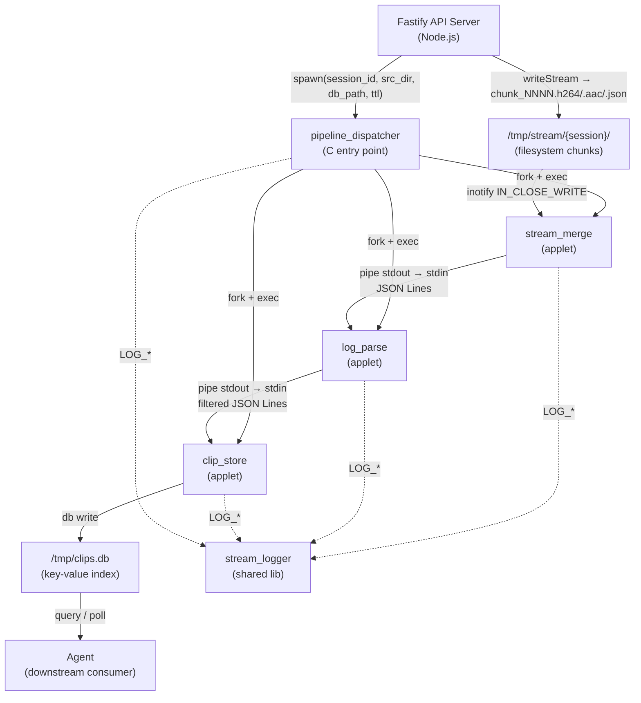

# socket-data-analyzer-c — v1 System Spec
> **版本**：v1.0 / 2026-05-11
> **定位**：本文件描述 `socket-data-analyzer-c` 子系統各模組之間的連動關係與介面契約。不涉及各模組的實作細節，細節請參閱對應的細部開發文件。

***
## 一、系統架構圖


***
## 二、模組清單
| 模組 | 類型 | 對應檔案 |
|---|---|---|
| `pipeline_dispatcher` | C entry point | `applets/pipeline_dispatcher.c` |
| `stream_merge` | BusyBox applet | `applets/stream_merge.c` |
| `log_parse` | BusyBox applet | `applets/log_parse.c` |
| `clip_store` | BusyBox applet | `applets/clip_store.c` |
| `stream_logger` | 共用函式庫 | `lib/stream_logger.c` |
| `libpipeline` | 共用函式庫 | `lib/libpipeline.c` |

***
## 三、模組間連動說明
### 3.1 Fastify → `pipeline_dispatcher`
Fastify 在收到 WS `video-in` frame 後，同步執行兩件事：

1. 透過 `writeStream` 將解析後的 chunk 寫入 `/tmp/stream/{session_id}/` 目錄
2. 以 `child_process.spawn()` 啟動 `pipeline_dispatcher`，傳入四個參數：`session_id`、`src_dir`、`db_path`、`ttl`

兩件事互不阻塞：WS 接收與 chunk 落地持續進行，`pipeline_dispatcher` 在獨立 process 中執行，Fastify 透過 exit code 判斷管線是否正常結束。

**介面**：CLI 參數（`argv`）傳入，exit code 傳回。Fastify 監聽 `stderr` 取得診斷訊息。

***
### 3.2 `pipeline_dispatcher` → 三個 applet
`pipeline_dispatcher` 使用 `pipe()` + `fork()` + `exec()` 建立以下管線：

```
stream_merge  stdout
      │  pipe_1
      ▼
log_parse     stdin / stdout
      │  pipe_2
      ▼
clip_store    stdin
```

`pipeline_dispatcher` 本身不讀寫任何業務資料，只負責：
- 建立 `pipe_1`、`pipe_2`
- 以正確的 fd 重定向（`dup2`）啟動三個子 process
- 關閉父進程中所有 pipe fd
- 以 `waitpid()` 等待並收集三個子 process 的退出狀態

任一子 process 非正常退出，`pipeline_dispatcher` 回傳 `-2` 給 Fastify。

**介面**：UNIX pipe（`pipe_1`、`pipe_2`），`waitpid` 退出狀態。

***
### 3.3 Filesystem → `stream_merge`
`stream_merge` 透過 `libpipeline` 提供的 `pipeline_watch_dir()` 封裝，以 `inotify` 監聽 `src_dir`（`/tmp/stream/{session_id}/`）。

觸發事件：`IN_CLOSE_WRITE`（Fastify `writeStream` 關閉 chunk 檔案時）

每次事件觸發，`stream_merge` 讀取新抵達的 chunk 檔，進行品質檢查、gap 偵測、buffer 累積，每滿 5s 或偵測到 gap 時，輸出一條 clip JSON Line 到 `pipe_1`。

**介面**：`inotify` 事件（filesystem 邊界），`pipe_1` stdout（與 `log_parse` 的邊界）。

***
### 3.4 `stream_merge` → `log_parse`（透過 `pipe_1`）
`stream_merge` 的 stdout 直接接通 `log_parse` 的 stdin。資料格式為**壓縮 JSON Lines**，每行一個完整 JSON 物件，以 `\n` 為分隔符。

`log_parse` 以 `--filter type=clip` 過濾，只讓 clip 類型的 JSON Line 通過，其餘類型（如 metrics、heartbeat）被靜默丟棄。過濾後的 JSON Line 輸出到 `pipe_2`。

**介面**：`pipe_1`（JSON Lines，純 stdin/stdout，無共享記憶體）。

***
### 3.5 `log_parse` → `clip_store`（透過 `pipe_2`）
`log_parse` 的 stdout 直接接通 `clip_store` 的 stdin。`clip_store` 讀取每條 clip JSON Line，提取 `session_id` 與 `ts` 組合成 key，將 `path` 作為 value，加上 TTL 寫入 `clips.db`。

每筆寫入成功後，`clip_store` 輸出一條操作確認 JSON 到自身的 stdout（僅供 debug，`pipeline_dispatcher` 不讀取此輸出）。

**介面**：`pipe_2`（JSON Lines），`clips.db` 檔案（filesystem 邊界）。

***
### 3.6 `clip_store` → Agent（下游消費）
Agent 不在本子系統範疇內，透過兩種方式消費 `clip_store` 的輸出：

| 消費方式 | 指令 | 適用場景 |
|---|---|---|
| 拉模式查詢 | `clip_store --db /tmp/clips.db --list --filter session_id=sess_001` | Agent 定期 polling |
| 管線即時消費 | `stream_merge \| log_parse \| clip_store \| agent_consumer` | 需要最低延遲 |

**介面**：`clips.db` 純文字 key-value 檔案，或 stdout JSON Lines（即時管線模式）。

***
### 3.7 `stream_logger`（橫切面依賴）
`stream_logger` 是所有模組共用的日誌函式庫，不參與業務資料流。各模組透過 `#include "stream_logger.h"` 引入，使用 `LOG_INFO()`、`LOG_WARN()` 等巨集輸出診斷訊息。

**約定**：所有診斷訊息只走 **stderr**，不污染任何 pipe 的 stdout 資料流。

***
## 四、資料流總覽
```
ESP32-S3 WS frame
    │
    ▼
Fastify (解析 frame_type + seq + payload)
    ├── writeStream → /tmp/stream/{session}/video/chunk_NNNN.h264
    ├── writeStream → /tmp/stream/{session}/audio/chunk_NNNN.aac
    ├── writeStream → /tmp/stream/{session}/meta/chunk_NNNN.json
    └── spawn → pipeline_dispatcher
                    │
                    ├─ pipe_1 ─────────────────────────────────────┐
                    │                                               │
              [stream_merge]                                  [log_parse]
              inotify 監聽                                    stdin 讀取
              5s 切割                                         type=clip 過濾
              gap 偵測                                        stdout 輸出
              stdout → pipe_1                                       │
                                                             pipe_2 │
                                                                    ▼
                                                            [clip_store]
                                                            stdin 讀取
                                                            寫入 clips.db
                                                                    │
                                                                    ▼
                                                            /tmp/clips.db
                                                                    │
                                                                    ▼
                                                              Agent 消費
```

***
## 五、模組介面契約摘要
| 連動邊界 | 介面類型 | 格式 | 方向 |
|---|---|---|---|
| Fastify → `pipeline_dispatcher` | `spawn()` CLI 參數 | `argv[]` 字串 | 單向呼叫 |
| Fastify ← `pipeline_dispatcher` | exit code + stderr | 整數 / 文字 | 回傳結果 |
| `pipeline_dispatcher` → applets | `fork` + `exec` | CLI argv + fd 重定向 | 單向啟動 |
| `stream_merge` → `log_parse` | UNIX pipe | JSON Lines（UTF-8） | 單向串流 |
| `log_parse` → `clip_store` | UNIX pipe | JSON Lines（UTF-8） | 單向串流 |
| `clip_store` → filesystem | `write()` | Tab-separated text | 單向寫入 |
| filesystem → `stream_merge` | `inotify` | `IN_CLOSE_WRITE` 事件 | 事件通知 |
| 各模組 → `stream_logger` | 函式呼叫（`LOG_*`） | 格式化字串 | 單向輸出 |

***
## 六、錯誤傳播路徑
異常從子工具向上傳遞遵循 UNIX cascade close 機制：

```
stream_merge 崩潰
    → pipe_1 write end 關閉
    → log_parse 讀到 EOF → 正常退出
    → pipe_2 write end 關閉
    → clip_store 讀到 EOF → 正常退出
    → pipeline_dispatcher 的 waitpid() 收到所有退出狀態
    → pipeline_dispatcher exit(-2)
    → Fastify spawn 'exit' 事件觸發告警
```

任一環節的崩潰都能**自動清理整條管線**，不留孤兒 process。

***
## 七、開發分工介面
各模組可完全獨立開發，只需遵守以下介面約定：

| 模組 | 只需知道 | 不需要知道 |
|---|---|---|
| `stream_merge` | `libpipeline.h`、JSON Lines 輸出格式 | `log_parse` 如何過濾 |
| `log_parse` | JSON Lines 輸入格式、`stream_logger.h` | `stream_merge` 如何產生資料 |
| `clip_store` | 過濾後 JSON Lines 輸入格式、`stream_logger.h` | `log_parse` 的過濾邏輯 |
| `pipeline_dispatcher` | 各 applet 的 CLI 介面 | 任何 applet 的內部實作 |

***

*本文件為 `socket-data-analyzer-c` v1 系統規格，對應細部文件請參閱各模組的 `*_dev_doc`。*
*v1.0 — 2026-05-11*